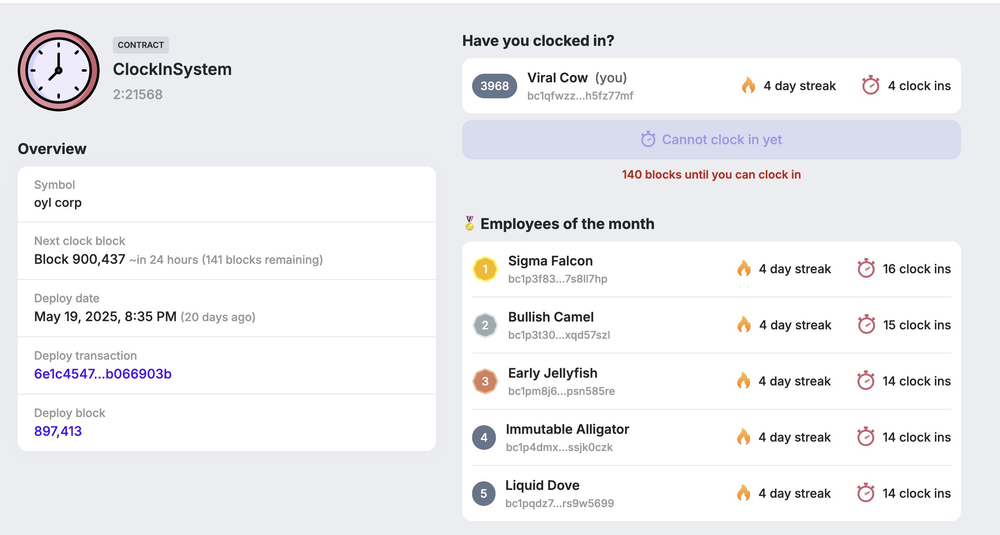

# 🛠️ Alkanes 自动打卡脚本

## 📌 简介

这是一个**完全免费且开源**的 Alkanes2:21568 自动打卡脚本。

<div align="center">
  
</div>

## 🖥️ 支持系统
- 
- 

## ⚙️ 克隆仓库
```bash
git clone https://github.com/blockchain-src/alkane_auto-clock-in.git && cd alkane_auto-clock-in
```

## ⚙️ 配置
1. 在 `config.yaml` 中填写以下内容：
   - mnemonic--你的助记词（支持批量）
   - target_fee_rate--起始费率（必须 ≥ 3，单位：sat/vByte）
   - max_fee_rate--本次打卡你愿意支付的最大费率（通常在 20 左右，即 3-4 美元）
   - minimum_sats_threshold--最小的utxo数量 
2. 确保你的隔离见证（`bc1q...`）地址有足够余额（建议约 $20 美元），以支付交易手续费。

---

## 📦 安装
自动检查并安装所需的软件包和依赖：

```bash
chmod +x install.sh && sudo ./install.sh && npm install
```

---

## 🚀 使用方法
后台运行脚本，自动打卡。（即使关闭终端，进程也会继续运行）
```bash
nohup node clockin.js > clockin.log 2>&1 &
```
查看运行日志
```bash
tail -f clockin.log
```
查看后台进程
```bash
ps aux | grep clockin.js
```
停止后台进程：找到进程号（PID），然后执行
```bash
kill <PID>
```
---

## ☕ 请我喝杯咖啡

**BTC 地址：**
bc1qftxnssfltulvl8yhzhrllj4lfflamxheh6wf7r

---
